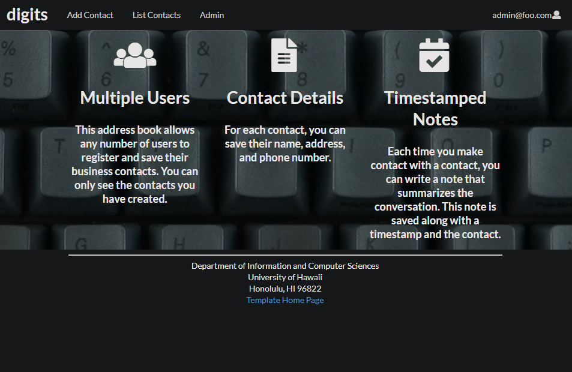
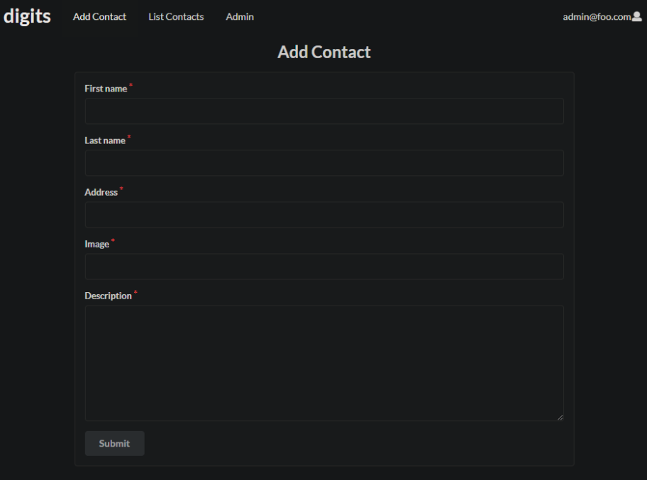
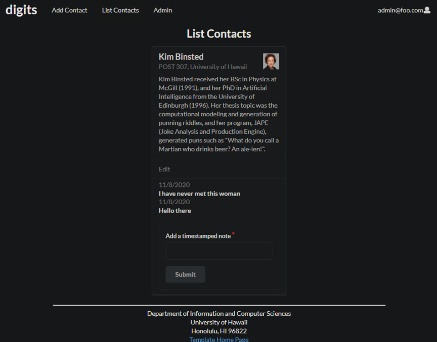
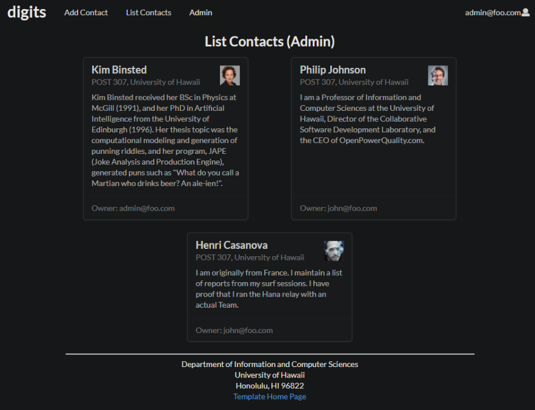

# Digits

# Installation
To install, clone this repository to your desktop, and change the running directory to app, then run "meteor npm run start"

# Add Contacts

In the add contacts page, you can specify your new contact's name, address, image, and description of the person.

# List Contacts

In the list contacts page, it will list all the contacts that is associated with your account. You can see each contact, and add a note which will be timestamped and tagged along with the contact's card.

Along with the list contacts page, an admin account can view all contacts within the website, seeing other user's contacts.
